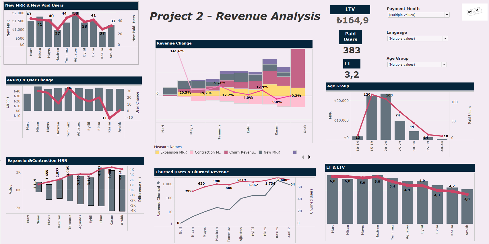

# 📊 Tableau_Revenue_Analysis

## 📖 Overview
Bu proje, Tableau panoları ve SQL sorguları kullanılarak gelir eğilimlerini analiz etmektedir. Analiz edilen temel metrikler şunlardır:
- 📈 Monthly Revenue Growth 
- 🔄 Churn Analysis
- 📊 Expansion and Contraction Metrics
- 🏆 Customer Lifetime Value (LTV)
- 👥 User Segmentation by Age Group
  

## 🖼️ 

## Key Insights
### New MRR & New Paid Users
Mart ve Nisan aylarında yeni MRR ve ödeme yapan kullanıcı sayılarında artış gözlemlendi. Kampanyaların etkisi olduğu düşünülen bu artış, yaz aylarında müşteri sadakati için fırsatlar sunabilir.

### ARPPU & Users Change
Kasım ayında ARPPU sabit kalırken kullanıcı sayısında düşüş yaşandı. Bu durum, kullanıcı kayıplarının nedenlerinin detaylı analiz edilmesini gerektiriyor.

### Expansion & Contraction MRR
Mart, Haziran, Temmuz ve Ekim aylarında genişleme MRR pozitif seyretmiştir. Ancak diğer aylarda daralma MRR artış göstermiştir.

### Revenue Change
Mart ayında %141,6'lık gelir artışı dikkat çekici. Kasım ayında gelirde düşüş gözlemlenmiştir.

### Churned Users & Revenue
Nisan ayından itibaren churn kullanıcı sayısında artış gözlemlendi ve bu durum geliri olumsuz etkiledi.

### Age Group
15-24 yaş grupları en yüksek gelir sağlayan segment olarak dikkat çekiyor.

### LT & LTV
Haziran ayına kadar yüksek olan LT ve LTV, yaz sonrasında düşüş göstermiştir. Bu trend, kullanıcı sadakatine yönelik stratejik müdahaleler gerektiriyor.

## 🌐 Tableau Public Linki
Dashboard'ı incelemek için: [Tableau Public](https://public.tableau.com/app/profile/secil.bilgin/viz/Project2_17299404544860/Dashboard1)

